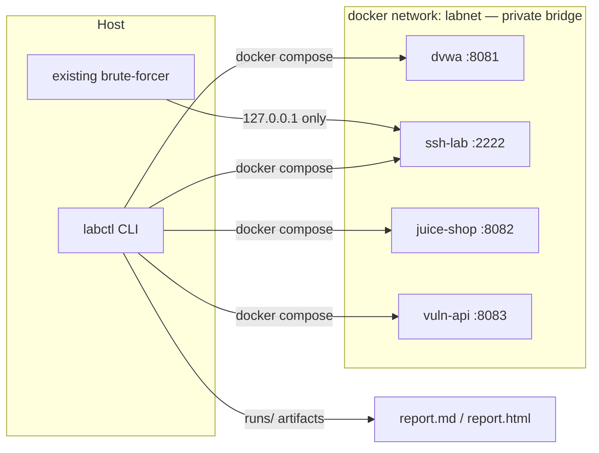

# Lab-in-a-Box

> ## ⚠ AUTHORIZED-USE-ONLY LAB
> Everything here runs on **localhost** behind a **private Docker bridge
> network**, and every published port binds to **127.0.0.1 only** — nothing is
> exposed to your LAN/WAN. It is for your personal security testing, learning,
> and CTF practice. **Never point these tools at systems you do not own or lack
> written permission to test.** The targets intentionally contain
> vulnerabilities — keep them off any reachable network.

Lab-in-a-Box is a **Docker Compose + Python CLI** that provisions a personal,
intentionally-vulnerable testing lab, configures it (security levels, seeded
accounts), optionally runs your existing brute-force tool against it, and
aggregates everything into a single Markdown/HTML report.

```
labctl up → labctl set-level dvwa medium → labctl seed
         → labctl run-brute --target ssh-lab → labctl report
         → labctl down
```

## Targets

| Service | Image / source | Published port | Purpose |
|---|---|---|---|
| dvwa | `vulnerables/web-dvwa` | 127.0.0.1:8081 | SQLi / XSS / broken auth; level is configurable low → impossible |
| ssh-lab | `./ssh-lab` (placeholder paramiko server) | 127.0.0.1:2222 | SSH credential-stuffing / brute force |
| juice-shop | `bkimminich/juice-shop` | 127.0.0.1:8082 | OWASP Juice Shop — broad OWASP Top 10 practice |
| vuln-api | `./vuln-api` (custom Flask) | 127.0.0.1:8083 | BOLA, SQL injection, mass assignment, plaintext creds |

**vuln-api tradeoff:** a minimal custom Flask API was chosen over OWASP crAPI
because it is one self-contained container, builds reliably offline, and works
on the `internal` network (crAPI is a multi-service app with MongoDB plus
external callback services that would break without outbound internet). The
cost: it is synthetic code rather than a real-world app — see `vuln-api/app.py`
for its documented vulnerabilities.

## Architecture



All container-to-host traffic is over 127.0.0.1 published ports.

## Quickstart

Prerequisites: Docker with Compose v2, Python 3.9+.

```bash
cd lab-in-a-box
python3 -m venv .venv
.venv/bin/pip install -e .        # installs the `labctl` command (or use ./bin/labctl)
cp .env.example .env

labctl up                          # pulls images, boots, waits for healthy
labctl status                      # health + reachability table
labctl set-level dvwa medium       # DVWA: low|medium|high|impossible
labctl seed                        # create labuser/labpass123 on each target
labctl run-brute --target ssh-lab  # real tool once brute.tool is set (see below)
labctl report --html               # runs/<timestamp>/report.md + .html
labctl down                        # tear down; --purge also wipes volumes
```

## Commands

| Command | What it does |
|---|---|
| `labctl up` | `docker compose up -d`, polls healthchecks, prints a status table |
| `labctl down [--purge]` | Tear down; `--purge` removes seeded-data volumes |
| `labctl status` | Per-target Docker health + host reachability |
| `labctl set-level <target> <level>` | DVWA only (low/medium/high/impossible); others report N/A |
| `labctl seed` | Idempotently create placeholder accounts from `lab.yaml` |
| `labctl run-brute --target <name> [--wordlist path]` | Run brute-forcer, save JSON to `runs/<ts>/<target>-brute.json` |
| `labctl report [--run <ts>] [--html]` | Aggregate one run dir into `report.md` (+ HTML) |

## Configuration — `lab.yaml`

```yaml
network: labnet
targets:
  dvwa:
    security_level: medium     # low | medium | high | impossible
    seed_user: labuser
    seed_pass: labpass123
  ssh-lab:                     # env-backed placeholder creds
    seed_user: labuser
    seed_pass: labpass123
  juice-shop:
    seed_user: labuser
    seed_pass: labpass123
  vuln-api:
    seed_user: labuser
    seed_pass: labpass123
brute:
  default_wordlist: ./wordlists/common.txt
  tool: null                   # see "Plug in your brute-forcer"
  usernames: ./wordlists/usernames.txt
boot_timeout_seconds: 300
```

Credentials are placeholders, defined in `.env.example`, with `.env` gitignored.

## Plug in your existing tools

### ssh-lab
Drop your existing server's `Dockerfile` / `server.py` into `./ssh-lab/` (see
`ssh-lab/README.md`). Keep port 22 exposed and read the seeded creds from the
`SSH_SEED_USER` / `SSH_SEED_PASS` env vars or `/labdata/users.json`.

> macOS note: Docker Desktop's published-port proxy can wedge under high SSH
> concurrency. If a real brute run stalls, lower `--threads` in `brute.py` or
> run your native server on the host instead.

### Brute-forcer
The lab ships with a deterministic **mock** so the full pipeline works before
you plug anything in. To use your real tool, point `brute.tool` at it:

```yaml
brute:
  tool: /Users/giofiore/Downloads/testing/ssh_brute.py
  usernames: ./wordlists/usernames.txt
  default_wordlist: ./wordlists/common.txt
```

The tool runs under `brute.python` if set, else a sibling `.venv/` next to the
tool (ssh_brute.py needs paramiko from its own venv), else the lab venv.

The stock integration invokes the tool as
`<python> <tool> --host 127.0.0.1 --port <target-port> --usernames FILE --passwords FILE`
and parses stdout for `[+] user:pass` and the
`[*] attempts=... confirmed=...` summary. Other tools: implement the contract
in `labctl/brute.py::_run_real` (returns a dict — see the docstring for the
shape). No attack logic is reimplemented in this repo; the brute-forcer is only
shelled out to.

## Safety design (enforced in `docker-compose.yml`)

- **All port bindings are `127.0.0.1` only** — never `0.0.0.0`; nothing is
  exposed to the LAN/WAN. This is the primary boundary.
- **`labnet` is a private user-defined bridge** — targets are not on a default
  bridge and are only reachable by name inside the lab.
- **Why not `internal: true`?** On Docker Desktop, published ports are silently
  *not opened* for containers attached only to an `internal: true` network
  (verified empirically: same image, normal bridge → port published; internal
  → port never opens). Since the lab's whole point is that host-side tools hit
  it over 127.0.0.1 published ports, the internal flag is incompatible here.
  If you want the lab blackholed from the internet entirely, the relay-bastion
  pattern gives you both: keep `labnet` `internal: true`, add a tiny `socat`
  relay container attached to `labnet` *and* a normal network, and publish the
  127.0.0.1 ports on the relay instead of the targets.
- **Placeholder credentials only** (`labuser` / `labpass123`), in `.env` +
  `lab.yaml`; `.env` is gitignored.
- **No exploit code in this repo** — the brute-forcer integration only shells
  out to your existing tool; the lab targets themselves are the point.

## Project layout

```
lab-in-a-box/
  docker-compose.yml
  lab.yaml
  .env.example
  labctl/                 # CLI package
    cli.py                #   click entrypoints
    config.py             #   lab.yaml loading/validation
    compose.py            #   docker compose wrapper + healthchecks
    security_level.py     #   DVWA security level
    seed.py               #   account seeding
    brute.py              #   brute-forcer interface (mock + real contract)
    report.py             #   markdown/html aggregation
  ssh-lab/                # placeholder paramiko server (swap me)
  vuln-api/               # custom vulnerable Flask API
  wordlists/              # common.txt, usernames.txt
  runs/                   # gitignored per-run output
```

## Troubleshooting

- **`docker compose up` is slow on first run** — it pulls `web-dvwa` and
  `juice-shop` images; juice-shop can take ~60s to boot.
- **DVWA `set-level` says login failed** — the stock image uses
  `admin`/`password` (set `DVWA_ADMIN_USER`/`DVWA_ADMIN_PASS` in `.env` if
  your image differs).
- **`run-brute` against ssh-lab stalls with a real tool** — see the macOS note
  above; lower threads or run the server natively.
- **Port conflicts** — 8081/8082/8083/2222 must be free; change the
  `127.0.0.1:<host>:<container>` bindings in `docker-compose.yml` and update
  the matching port in `labctl/config.py::TARGET_PORTS`.
- **Lab unreachable from the host despite healthy containers** — if you
  switched `labnet` to `internal: true` (or are on a Docker Desktop that doesn't
  publish ports from internal networks), published ports won't open. Keep the
  network a plain bridge, or use the relay-bastion pattern described above.
